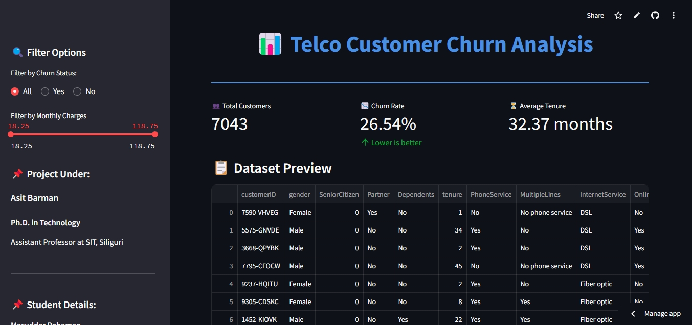

# 📊 Telco Customer Churn Analysis
### 🎨 Dashboard Overview


## 🚀 Project Overview
This project is an interactive **Telco Customer Churn Analysis Dashboard** built using **Streamlit** and various data visualization libraries, including **Seaborn, Matplotlib, and Plotly**. The goal is to provide insights into customer churn trends, monthly charges distribution, and correlations between key features.

## 🔧 Features
- **📊 Interactive Dashboard:** A visually appealing interface for analyzing customer churn.
- **📌 Dynamic Filtering:** Filter data by churn status and monthly charges range.
- **📉 Churn Rate Analysis:** Histogram showing the distribution of churned and retained customers.
- **💰 Monthly Charges Insights:** Visualizes customer billing behavior.
- **📌 Correlation Heatmap:** Highlights relationships between numerical features.
- **🌍 Customer Location Map:** Displays a mock distribution of customers on a geographic map.
- **💡 Key Takeaways:** Summarizes important findings for business decision-making.

## 🛠️ Tech Stack
- **Programming Language:** Python
- **Framework:** Streamlit
- **Data Analysis:** Pandas, NumPy
- **Visualization:** Seaborn, Matplotlib, Plotly
- **Map Integration:** Plotly Express (Scatter Mapbox)
- **UI Styling:** Custom CSS

## 📂 File Structure
```
├── WA_Fn-UseC_-Telco-Customer-Churn.csv  # Dataset
├── app.py  # Streamlit dashboard script
├── README.md  # Project documentation
└── requirements.txt  # Required Python dependencies
```

## 🏗️ Setup and Installation
1. **Clone the repository:**
   ```sh
   git clone https://github.com/your-username/telco-churn-analysis.git
   cd telco-churn-analysis
   ```
2. **Create a virtual environment (Optional but recommended):**
   ```sh
   python -m venv env
   source env/bin/activate  # On macOS/Linux
   env\Scripts\activate  # On Windows
   ```
3. **Install dependencies:**
   ```sh
   pip install -r requirements.txt
   ```
4. **Run the application:**
   ```sh
   streamlit run app.py
   ```

## 📊 Dataset
The dataset used is **"WA_Fn-UseC_-Telco-Customer-Churn.csv"**, which contains customer demographics, account details, and subscription details.

### Key Columns:
- **CustomerID** - Unique customer identifier
- **Gender** - Customer gender (Male/Female)
- **SeniorCitizen** - Whether the customer is a senior citizen
- **Tenure** - Number of months the customer has been with the company
- **MonthlyCharges** - Monthly bill amount
- **TotalCharges** - Total amount charged to the customer
- **Churn** - Whether the customer churned (Yes/No)


## 💡 Insights
- Customers with **higher monthly charges** tend to have a **higher churn rate**.
- Shorter-tenured customers are more likely to **churn quickly**.
- Understanding these patterns can help **optimize retention strategies**.

## ✨ Future Enhancements
- Add **ML-based churn prediction models**.
- Integrate **real-world customer location data**.
- Implement **better UI components with Bootstrap or Material UI**.

## 🤝 Contributing
Contributions are welcome! Feel free to **fork the repo**, create a new branch, and submit a **pull request**.

## 📜 License
This project is licensed under the **MIT License**.

## 📞 Contact
- **Author:** Masuddar Rahaman
- **LinkedIn:** [Your LinkedIn Profile](https://www.linkedin.com/in/masuddar-rahaman-b5044b283/)
- **Gmail:** masuddarrahaman31@gmail.com
  

